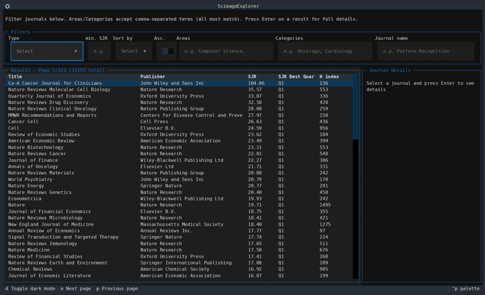

# scimago-explorer

[](https://github.com/andrea-pollastro/scimago-explorer/actions/workflows/ci.yml)
[](https://www.python.org/downloads/)
[](https://github.com/Textualize/textual)
[](LICENSE)

A terminal UI (TUI) for browsing and filtering [Scimago Journal & Country Rank](https://www.scimagojr.com/journalrank.php) data, built with [Textual](https://github.com/Textualize/textual).

Load a Scimago journal ranking CSV export and interactively filter by type, minimum SJR, subject areas, categories, and journal name, sort the results, and inspect full details (including per-category quartiles) for any journal.



## Requirements

- Python 3.10+
- A Scimago journal rankings CSV (see [Data](#data) below)

## Installation

```bash
git clone git@github.com:andrea-pollastro/scimago-explorer.git
cd scimago-explorer
python -m venv .venv
source .venv/bin/activate
pip install -r requirements.txt
```

## Data

This project does not download data automatically. Get a CSV export from the [Scimago Journal & Country Rank](https://www.scimagojr.com/journalrank.php) website and place it under `data/`.

The exact file name and the columns available depend on the export, so the ingestion pipeline is config-driven rather than hardcoded:

- [`conf/scimago_data.yaml`](conf/scimago_data.yaml) points to the CSV file (`path`), its separator (`sep`), which columns to drop (`columns_to_drop`), and how to fill missing values per column (`nan_map`).
- [`conf/explorer.yaml`](conf/explorer.yaml) controls the UI: page size, minimum terminal size, which columns are shown in the results table (`display_columns`) and their relative widths (`column_width_weights`), and the relative widths of the filter widgets (`search_bar_weights`).

If Scimago changes the export format (file name, column names), update these two files accordingly — no code changes should be needed for that.

## Usage

```bash
python main.py
```

Logging is disabled by default. To enable it:

```bash
python main.py --log-level DEBUG --log-file app.log
```

### Keybindings

| Key | Action |
| --- | --- |
| `n` | Next page |
| `p` | Previous page |
| `d` | Toggle dark/light theme |
| `Enter` (on a result row) | Show full journal details |

### Filters

Type, minimum SJR, sort field/order, Areas, Categories, and Journal name filters are available above the results table. Areas and Categories accept comma-separated terms; all terms must match.

## Development

Install dev dependencies and run the test suite:

```bash
pip install -r requirements-dev.txt
pytest
```

Tests run against synthetic data and don't require a real Scimago export, so they stay stable across data updates. CI runs them on Python 3.10–3.14 on every push/PR to `main`.

## License

[MIT](LICENSE)
